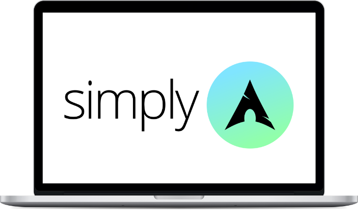
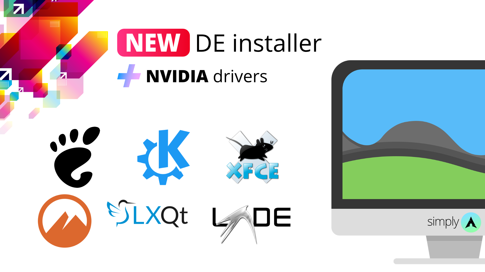

<h1 align="center">SimplyArch Installer</h1>

	The simplest way to install Arch Linux where you choose to bloat or not to bloat

### Disclaimer
THE SOFTWARE IS PROVIDED "AS IS", WITHOUT WARRANTY OF ANY KIND,
EXPRESS OR IMPLIED
## Pre-requisites 🔎
- A working internet connection
- **Being a somewhat advanced user**
- A previously partitioned disk
- **UEFI & BIOS autodetection**
### Filesystem Support
- EXT4
- **(NEW)** Initial BTRFS support (special thanks to [@lenuswalker](https://github.com/lenuswalker))
## ⚡ How to use it 🚀
	
	# Boot latest Arch Linux ISO
	
	# Connect to the Internet, if you're using WiFi you can do this
	iwctl
	device list
	station device scan
	station device get-networks
	station device connect SSID 
	
	# Load your keyboard layout
	loadkeys us-acentos
	
	# Partition your disk with the tool of your choice
	cfdisk
	
	# Run the script and follow on-screen instructions
	curl -L is.gd/simplyarch > run ; sh run

## What the base script will do ✅
- Install a functional base system
- Setup your keyboard, locales, timezone and hostname
- Create a standard user with sudo permissions
- Install popular utilities such as `vim` `nano` `htop` `neofetch` and our `simple_reflector.sh` tool
- **(NEW)** Installs `paru` as the AUR helper instead of `yay`
## What the base script won't do 🚫
- Install any driver not included within the kernel
- Install a DE/WM or any GUI application
- Make questionable choices for you
## And now what? ❓
- Choose to `bloat` (optional)
- Install drivers not included with the kernel if your hardware needs it (e.g. Nvidia, Broadcom, VAAPI, etc)
- Install `xorg-core`, a DM and the DE/WM of your choice
- Install any other application you need
- Profit
## Introducing `bloat` 🐌
If you don't like the Arch way of doing stuff with the terminal we have prepared you a **completely optional** and simple post-installation script to help you finish setting up your Arch Linux system by installing a desktop environment, propietary drivers (optional), Flatpak support and more.

### Has SimplyArch become what it swore to destroy?
- **No**, select None when installation finishes to skip `bloat` and keep rolling 😇
- The base SimplyArch script **will continue to be a separate component that provides only a minimal system**
- **ProTip:** Review the choices `bloat.sh` will make for you
### Supported desktop environments (DE) 🖥️
- GNOME (minimal install included)
- KDE Plasma
- Xfce
- LXQt
- LXDE
- Cinnamon
## Project file structure 📁
- `simplyarch.sh`: our base and main script
- `simple-reflector.sh`: a simple script that uses the `reflector` tool to fetch an updated list of fastest 20 mirrors, this script gets copied to the home folder on every install for convenience purposes
- `bloat.sh`: the optional post-installation script
- `run.sh`: bootsrapper script
- `README.md`: this file
- `LICENSE.md`: MIT License
- `img` folder: as the name says
## I want to help SimplyArch development 🙋‍♀️🙋‍♂️
Feel free to open an Issue or Pull Request and I'll be happy to receive any feedback or code improvement
