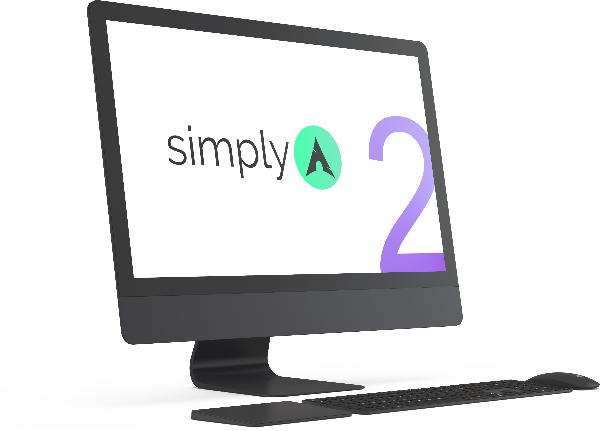

<h1 align="center">SimplyArch Installer 2</h1>

	⚡ Faster, better ⚡

## Disclaimer ⚠

THE SOFTWARE IS PROVIDED "AS IS", WITHOUT WARRANTY OF ANY KIND, EXPRESS OR IMPLIED.

## Pre-requisites 🔎

- A working internet connection.
- A previously partitioned disk (you can use `cfdisk`, `fdisk`, `parted` or the tool of your preference).

Tip 💡: See reference partition layouts for UEFI and BIOS at the [Arch Linux Wiki](https://wiki.archlinux.org/title/Partitioning#Example_layouts).

## How to use it? 🚀

From a booted [Arch Linux ISO](https://archlinux.org/download) just type:

	curl -L is.gd/simplyarch > run ; sh run

## Main features ✨

### Minimal base OS

Only the packages you need to start your Arch Linux journey, nothing you don't!

### Filesystems supported

- EXT4
- BTRFS (special thanks to [@lenuswalker](https://github.com/lenuswalker))
- NEW! XFS (with big timestamps)

### Kernel selector

Choose between the officially supported Arch Linux kernel flavors:

- linux
- linux-lts
- linux-zen
- linux-hardened

Learn more at the [Arch Linux Wiki](https://wiki.archlinux.org/title/kernel#Officially_supported_kernels).

### Blazing fast installation

- Powered by the superb [rate-mirrors](https://github.com/westandskif/rate-mirrors) tool and Pacman 6.0 multithreaded downloads.
- Updated mirrors on installed system for a more pleasing experience.

### Install the AUR helper of your preference

Choose between [Yay](https://github.com/Jguer/yay), [Paru](https://github.com/Morganamilo/paru) or none.

### More secure

Automatic CPU microcode installation to protect you against hardware flaws.

## Completely optional postinstall wizard ⚙ 📦 🖥️

A plain TTY is not enough for you?, we got you covered!

### Desktop environment installer

Choose the one you like the most without fearing for bloated installations, we try to keep them simple.

- GNOME
- KDE Plasma
- Xfce
- MATE
- LXQt
- LXDE
- Cinnamon
- Cutefish

### Automatic VM guest additions installer

Installing Arch Linux inside a VM?, don't worry we can install them for KVM, VirtualBox and VMWare.

### Smart driver installer

Have an Nvidia GPU? Nvidia GPU on laptop? Broadcom WiFi? Intel or AMD GPU and needing VAAPI for hardware acceleration?, our driver installer will take care of those.

### App installer

Choose among 24 browsers, productivity software, system utilities and more.

## I want to help SimplyArch development 🙋‍♀️🙋‍♂️

Feel free to open an Issue or Pull Request and I'll be happy to receive any feedback or code improvement.
